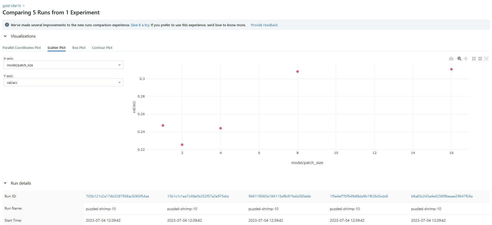
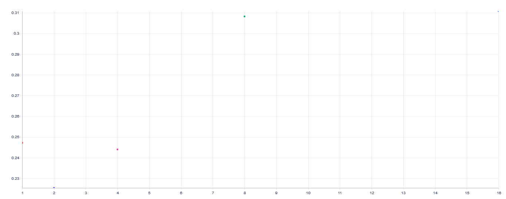

# EMLOv3 | Assignment 6

[](https://pytorch.org/get-started/locally/)
[](https://pytorchlightning.ai/)
[](https://hydra.cc/)
[](https://black.readthedocs.io/en/stable/)


## ViT on CIFAR10 Data 
The module is called <em>'gold'</em>.
- It supports models available in TIMM for compatible datasets.
- VIT model for training, evaluation & inference on CIFAR10 dataset.
- Experiment tracking using MLFlow, AIM, Tensorboard & CSV logger.
- The functionality control for overall moduls is provded by Hydra


## DVC Setup

1. Use the following command to setup DVC in project folder:

```bash
dvc init
```

2. To track the all relevant folders using DVC, run the following command:

```bash
dvc add data logs .aim
```

3. To add the relevant folders to remote storage (in the local storage, outside the project folder), run the following command:

```bash
dvc remote add -d local ../dvc_storage
```

4. To push the relevant folders to remote storage, run the following command:

```bash
dvc push -r local
```

5. To pull the relevant folders from remote storage, run the following command:

```bash
dvc pull -r local
```

## Docker Training

1. To build / pull the docker image, run the following command:

```bash
docker build -t <name:tag> .
```

OR 

```bash
docker pull <dockerhub user_id>/<name:tag>
```

dockerhub link: https://hub.docker.com/r/salilgtm/EMLO_session06_Experiment_tracking

2. To run the docker image for training, run the following command:

```bash
docker run -it --expose 5000 -p 5000:5000 -v ${pwd}:/workspace --name gold-container <dockerhub user_id>/<name:tag> -m hydra/launcher=joblib hydra.launcher.n_jobs=5 experiment=cifar10 model.patch_size=1,2,4,8,16 data.num_workers=0 logger.mlflow.tags={'tag_column':'tag'}
```

3. To run the MLFlow UI, run the following command:

```bash
docker exec -it -w /workspace/logs/mlflow adamantium-container mlflow ui --host 0.0.0.0
```

## Logging results

### patch_size vs val/acc(mlflow)


### patch_size vs val/acc(aim)



## Author

- Vikas Jha